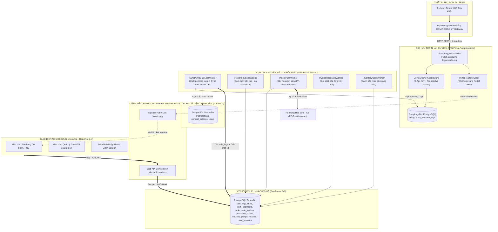

# Sơ đồ 1: Tổng quan Kiến trúc Hệ thống Quản trị Hiện hữu (pp-portal)

```mermaid
graph TB
    subgraph PUMP_EDGE["THIẾT BỊ TRỤ BƠM TẠI TRẠM"]
        P1["Trụ bơm điện tử / Bộ điều khiển"]
        P2["Bộ thu thập dữ liệu cổng COM/RS485 / IoT Gateway"]
        P1 --> P2
    end

    subgraph INGEST_SVC["DỊCH VỤ TIẾP NHẬN DỮ LIỆU (SPS.Portal.PumpIngestion)"]
        PUMP_API["PumpLoggerController<br/>POST /api/pump-logger/sale-log"]
        AUTH_MID["DeviceApiKeyMiddleware<br/>(X-Api-Key + Pre-resolve Tenant)"]
        RT_CLIENT["PortalRealtimeClient<br/>(Webhook sang Portal Web)"]
        PUMP_DB[("PumpLogsDb (PostgreSQL)<br/>bảng: pump_session_logs")]
        
        PUMP_API --> AUTH_MID
        AUTH_MID --> PUMP_DB
        PUMP_API --> RT_CLIENT
    end

    subgraph WORKERS_SVC["CỤM DỊCH VỤ NỀN XỬ LÝ & ĐỐI SOÁT (SPS.Portal.Workers)"]
        W_SYNC["SyncPumpSaleLogsWorker<br/>(Quét pending logs -> Sync vào Tenant DB)"]
        W_INV_PREP["PrepareInvoicesWorker<br/>(Gom lượt bán tạo Hóa đơn bán lẻ)"]
        W_INV_PUSH["IngestPushWorker<br/>(Đẩy hóa đơn sang PP-Trust-Invoices)"]
        W_INV_RECON["InvoiceReconcileWorker<br/>(Đối soát hóa đơn với Thuế)"]
        W_STOCK["InventoryAlertsWorker<br/>(Cảnh báo mức bồn xăng dầu)"]
    end

    subgraph TENANT_STORE["CƠ SỞ DỮ LIỆU KHÁCH THUÊ (Per-Tenant DB)"]
        TENANT_DB[("PostgreSQL TenantDb<br/>sale_logs, shifts, shift_segments,<br/>tanks, tank_intakes, purchase_orders,<br/>devices, pumps, nozzles, sale_invoices")]
    end

    subgraph MASTER_STORE["CƠ SỞ DỮ LIỆU TRUNG TÂM (MasterDb)"]
        MASTER_DB[("PostgreSQL MasterDb<br/>organizations, general_settings, users")]
    end

    subgraph PORTAL_WEB["CỔNG ĐIỀU HÀNH & API NGHIỆP VỤ (SPS.Portal.Web)"]
        WEB_API["Web API Controllers / MediatR Handlers"]
        SIGNALR["SignalR Hub / Live Monitoring"]
    end

    subgraph CLIENT_APP["GIAO DIỆN NGƯỜI DÙNG (clientApp - React/Next.js)"]
        POS["Màn hình Bán hàng Cột bơm / POS"]
        SHIFT_UI["Màn hình Quản lý Ca & Đối soát Số cơ"]
        TANK_UI["Màn hình Nhập kho & Giám sát Bồn"]
    end

    P2 ==>|HTTP REST + X-Api-Key| PUMP_API
    RT_CLIENT -.->|Internal Webhook| SIGNALR
    SIGNALR -.->|WebSocket realtime| POS

    W_SYNC -->|Đọc Pending Logs| PUMP_DB
    W_SYNC -->|Đọc Cấu hình Tenant| MASTER_DB
    W_SYNC ==>|Ghi sale_logs + Gắn shift_id| TENANT_DB

    W_INV_PREP --> TENANT_DB
    W_INV_PUSH --> TENANT_DB
    W_INV_PUSH ==>|Ký số & Phát hành| TRUST_INV["Hệ thống Hóa đơn Thuế (PP-Trust-Invoices)"]
    W_INV_RECON --> TENANT_DB
    W_STOCK --> TENANT_DB

    CLIENT_APP <==>|REST API JWT| WEB_API
    WEB_API <==>|Dapper UnitOfWork| TENANT_DB
```
