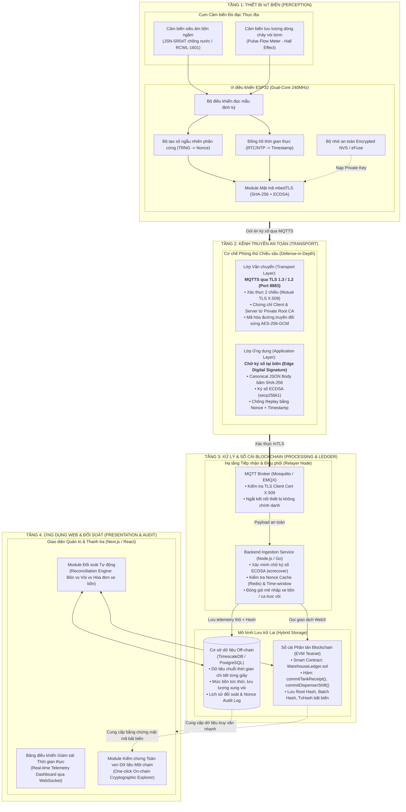

# Sơ đồ 2: PHẦN 2: THIẾT KẾ KIẾN TRÚC TỔNG THỂ 4 TẦNG (4-TIER ARCHITECTURE)

```mermaid
graph TB
    subgraph TIER1["TẦNG 1: THIẾT BỊ IoT BIÊN (PERCEPTION)"]
        direction TB
        subgraph SENS["Cụm Cảm biến Đo đạc Thực địa"]
            S1["Cảm biến siêu âm bồn ngầm<br/>(JSN-SR04T chống nước / RCWL-1601)"]
            S2["Cảm biến lưu lượng dòng chảy vòi bơm<br/>(Pulse Flow Meter - Hall Effect)"]
        end
        subgraph MCU["Vi điều khiển ESP32 (Dual-Core 240MHz)"]
            FSM["Bộ điều khiển đọc mẫu định kỳ"]
            TRNG["Bộ tạo số ngẫu nhiên phần cứng (TRNG -> Nonce)"]
            RTC["Đồng hồ thời gian thực (RTC/NTP -> Timestamp)"]
            CRYPTO["Module Mật mã mbedTLS (SHA-256 + ECDSA)"]
            STORAGE["Bộ nhớ an toàn Encrypted NVS / eFuse"]
        end
        S1 --> FSM
        S2 --> FSM
        FSM --> TRNG & RTC --> CRYPTO
        STORAGE -.->|Nạp Private Key| CRYPTO
    end

    subgraph TIER2["TẦNG 2: KÊNH TRUYỀN AN TOÀN (TRANSPORT)"]
        direction TB
        subgraph MTLS["Cơ chế Phòng thủ Chiều sâu (Defense-in-Depth)"]
            SEC_TRANS["Lớp Vận chuyển (Transport Layer):<br/><b>MQTTS qua TLS 1.3 / 1.2 (Port 8883)</b><br/>• Xác thực 2 chiều (Mutual TLS X.509)<br/>• Chứng chỉ Client & Server từ Private Root CA<br/>• Mã hóa đường truyền đối xứng AES-256-GCM"]
            SEC_APP["Lớp Ứng dụng (Application Layer):<br/><b>Chữ ký số tại biên (Edge Digital Signature)</b><br/>• Canonical JSON Body băm SHA-256<br/>• Ký số ECDSA (secp256k1)<br/>• Chống Replay bằng Nonce + Timestamp"]
        end
    end

    subgraph TIER3["TẦNG 3: XỬ LÝ & SỔ CÁI BLOCKCHAIN (PROCESSING & LEDGER)"]
        direction TB
        subgraph INGEST["Hạ tầng Tiếp nhận & Điều phối (Relayer Node)"]
            BROKER["MQTT Broker (Mosquitto / EMQX)<br/>• Kiểm tra TLS Client Cert X.509<br/>• Ngắt kết nối thiết bị không chính danh"]
            RELAYER["Backend Ingestion Service (Node.js / Go)<br/>• Xác minh chữ ký số ECDSA (ecrecover)<br/>• Kiểm tra Nonce Cache (Redis) & Time-window<br/>• Đóng gói mẻ nhập xe bồn / ca trực vòi"]
        end
        subgraph STORAGE_LAYER["Mô hình Lưu trữ Lai (Hybrid Storage)"]
            OFFCHAIN[("Cơ sở dữ liệu Off-chain<br/>(TimescaleDB / PostgreSQL)<br/>• Dữ liệu chuỗi thời gian chi tiết từng giây<br/>• Mức bồn tức thời, lưu lượng xung vòi<br/>• Lịch sử đối soát & Nonce Audit Log")]
            ONCHAIN["Sổ cái Phân tán Blockchain (EVM Testnet)<br/>• Smart Contract: WarehouseLedger.sol<br/>• Hàm: commitTankReceipt(), commitDispenserShift()<br/>• Lưu Root Hash, Batch Hash, TxHash bất biến"]
        end
        BROKER -->|Payload an toàn| RELAYER
        RELAYER -->|Lưu telemetry thô + Hash| OFFCHAIN
        RELAYER -->|Gọi giao dịch Web3| ONCHAIN
    end

    subgraph TIER4["TẦNG 4: ỨNG DỤNG WEB & ĐỐI SOÁT (PRESENTATION & AUDIT)"]
        direction TB
        subgraph WEBAPP["Giao diện Quản trị & Thanh tra (Next.js / React)"]
            DASHBOARD["Bảng điều khiển Giám sát Thời gian thực<br/>(Real-time Telemetry Dashboard qua WebSocket)"]
            RECONCILE["Module Đối soát Tự động<br/>(Reconciliation Engine: Bồn vs Vòi vs Hóa đơn xe bồn)"]
            VERIFY["Module Kiểm chứng Toàn vẹn Dữ liệu Một chạm<br/>(One-click On-chain Cryptographic Explorer)"]
        end
    end

    TIER1 ==>|Gói tin ký số qua MQTTS| TIER2
    TIER2 ==>|Xác thực mTLS| BROKER
    OFFCHAIN -.->|Cung cấp dữ liệu truy vấn nhanh| WEBAPP
    ONCHAIN -.->|Cung cấp bằng chứng mật mã bất biến| VERIFY
    RECONCILE <--> OFFCHAIN & ONCHAIN
```
