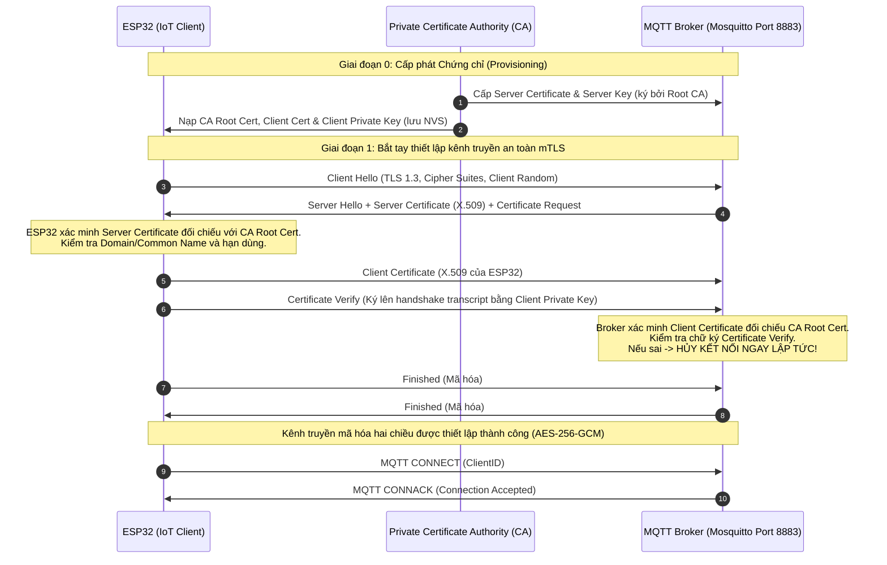

# Sơ đồ 3: Cơ chế Xác thực Chứng chỉ Hai chiều (Mutual TLS X.509)

```mermaid
sequenceDiagram
    autonumber
    participant ESP as ESP32 (IoT Client)
    participant CA as Private Certificate Authority (CA)
    participant BRK as MQTT Broker (Mosquitto Port 8883)

    Note over ESP,BRK: Giai đoạn 0: Cấp phát Chứng chỉ (Provisioning)
    CA->>BRK: Cấp Server Certificate & Server Key (ký bởi Root CA)
    CA->>ESP: Nạp CA Root Cert, Client Cert & Client Private Key (lưu NVS)

    Note over ESP,BRK: Giai đoạn 1: Bắt tay thiết lập kênh truyền an toàn mTLS
    ESP->>BRK: Client Hello (TLS 1.3, Cipher Suites, Client Random)
    BRK->>ESP: Server Hello + Server Certificate (X.509) + Certificate Request
    Note over ESP: ESP32 xác minh Server Certificate đối chiếu với CA Root Cert.<br/>Kiểm tra Domain/Common Name và hạn dùng.
    ESP->>BRK: Client Certificate (X.509 của ESP32)
    ESP->>BRK: Certificate Verify (Ký lên handshake transcript bằng Client Private Key)
    Note over BRK: Broker xác minh Client Certificate đối chiếu CA Root Cert.<br/>Kiểm tra chữ ký Certificate Verify.<br/>Nếu sai -> HỦY KẾT NỐI NGAY LẬP TỨC!
    ESP->>BRK: Finished (Mã hóa)
    BRK->>ESP: Finished (Mã hóa)

    Note over ESP,BRK: Kênh truyền mã hóa hai chiều được thiết lập thành công (AES-256-GCM)
    ESP->>BRK: MQTT CONNECT (ClientID)
    BRK->>ESP: MQTT CONNACK (Connection Accepted)
```
