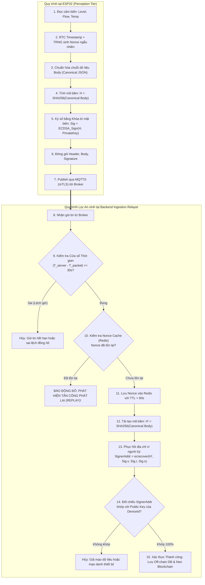

# Sơ đồ 4: Quy trình Ký và Xác thực 4 Bước tại Backend Relayer:

```mermaid
flowchart TD
    subgraph ESP_FLOW["Quy trình tại ESP32 (Perception Tier)"]
        A1["1. Đọc cảm biến: Level, Flow, Temp"] --> A2["2. RTC Timestamp + TRNG sinh Nonce ngẫu nhiên"]
        A2 --> A3["3. Chuẩn hóa chuỗi dữ liệu Body (Canonical JSON)"]
        A3 --> A4["4. Tính mã băm: H = SHA256(Canonical Body)"]
        A4 --> A5["5. Ký số bằng Khóa bí mật biên: Sig = ECDSA_Sign(H, PrivateKey)"]
        A5 --> A6["6. Đóng gói Header, Body, Signature"]
        A6 --> A7["7. Publish qua MQTTS (mTLS) tới Broker"]
    end

    subgraph BACKEND_FLOW["Quy trình Lọc An ninh tại Backend Ingestion Relayer"]
        B1["8. Nhận gói tin từ Broker"] --> B2{"9. Kiểm tra Cửa sổ Thời gian<br/>|T_server - T_packet| <= 30s?"}
        B2 -- Sai (Lệch giờ) --> ERR1["Hủy: Gói tin hết hạn hoặc sai lệch đồng hồ"]
        B2 -- Đúng --> B3{"10. Kiểm tra Nonce Cache (Redis)<br/>Nonce đã tồn tại?"}
        B3 -- Đã tồn tại --> ERR2["BÁO ĐỘNG ĐỎ: PHÁT HIỆN TẤN CÔNG PHÁT LẠI (REPLAY)!"]
        B3 -- Chưa tồn tại --> B4["11. Lưu Nonce vào Redis với TTL = 60s"]
        B4 --> B5["12. Tái tạo mã băm: H' = SHA256(Canonical Body)"]
        B5 --> B6["13. Phục hồi địa chỉ ví người ký:<br/>SignerAddr = ecrecover(H', Sig.v, Sig.r, Sig.s)"]
        B6 --> B7{"14. Đối chiếu SignerAddr<br/>khớp với Public Key của DeviceId?"}
        B7 -- Không khớp --> ERR3["Hủy: Giả mạo dữ liệu hoặc mạo danh thiết bị!"]
        B7 -- Khớp 100% --> B8["15. Xác thực Thành công: Lưu Off-chain DB & Neo Blockchain"]
    end

    A7 ==> B1
```
