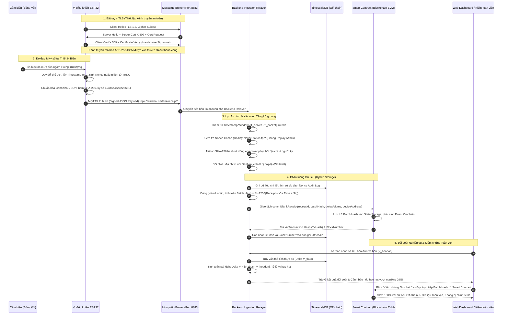

# Sơ đồ 5: Sơ đồ Tuần tự Hoạt động Đầu - Cuối (End-to-End Pipeline)

```mermaid
sequenceDiagram
    autonumber
    participant SENS as Cảm biến (Bồn / Vòi)
    participant ESP as Vi điều khiển ESP32
    participant BRK as Mosquitto Broker (Port 8883)
    participant RELAY as Backend Ingestion Relayer
    participant DB as TimescaleDB (Off-chain)
    participant SC as Smart Contract (Blockchain EVM)
    participant WEB as Web Dashboard / Kiểm toán viên

    Note over ESP,BRK: 1. Bắt tay mTLS (Thiết lập kênh truyền an toàn)
    ESP->>BRK: Client Hello (TLS 1.3, Cipher Suites)
    BRK->>ESP: Server Hello + Server Cert X.509 + Cert Request
    ESP->>BRK: Client Cert X.509 + Certificate Verify (Handshake Signature)
    Note over ESP,BRK: Kênh truyền mã hóa AES-256-GCM được xác thực 2 chiều thành công

    Note over SENS,ESP: 2. Đo đạc & Ký số tại Thiết bị Biên
    SENS->>ESP: Tín hiệu đo mức bồn ngầm / xung lưu lượng
    ESP->>ESP: Quy đổi thể tích, lấy Timestamp RTC, sinh Nonce ngẫu nhiên từ TRNG
    ESP->>ESP: Chuẩn hóa Canonical JSON, băm SHA-256, ký số ECDSA (secp256k1)
    ESP->>BRK: MQTTS Publish (Signed JSON Payload) topic "warehouse/tank/receipt"
    BRK->>RELAY: Chuyển tiếp bản tin an toàn cho Backend Relayer

    Note over RELAY: 3. Lọc An ninh & Xác minh Tầng Ứng dụng
    RELAY->>RELAY: Kiểm tra Timestamp Window: |T_server - T_packet| <= 30s
    RELAY->>RELAY: Kiểm tra Nonce Cache (Redis): Nonce đã tồn tại? (Chống Replay Attack)
    RELAY->>RELAY: Tái tạo SHA-256 hash và dùng ecrecover phục hồi địa chỉ ví người ký
    RELAY->>RELAY: Đối chiếu địa chỉ ví với Danh mục thiết bị hợp lệ (Whitelist)

    Note over RELAY,SC: 4. Phân luồng Dữ liệu (Hybrid Storage)
    RELAY->>DB: Ghi dữ liệu chi tiết, lịch sử đo đạc, Nonce Audit Log
    RELAY->>RELAY: Đóng gói mẻ nhập, tính toán Batch Hash = SHA256(Receipt + V + Time + Sig)
    RELAY->>SC: Giao dịch commitTankReceipt(receiptId, batchHash, deltaVolume, deviceAddress)
    SC->>SC: Lưu trữ Batch Hash vào State Storage, phát sinh Event On-chain
    SC-->>RELAY: Trả về Transaction Hash (TxHash) & BlockNumber
    RELAY->>DB: Cập nhật TxHash và BlockNumber vào bản ghi Off-chain

    Note over WEB,SC: 5. Đối soát Nghiệp vụ & Kiểm chứng Toàn vẹn
    WEB->>RELAY: Kế toán nhập số liệu hóa đơn xe bồn (V_hoadon)
    RELAY->>DB: Truy vấn thể tích thực đo (Delta V_thuc)
    RELAY->>RELAY: Tính toán sai lệch: Delta V = |V_thuc - V_hoadon|, Tỷ lệ % hao hụt
    RELAY-->>WEB: Trả về kết quả đối soát & Cảnh báo nếu hao hụt vượt ngưỡng 0.5%
    WEB->>SC: Bấm "Kiểm chứng On-chain" -> Đọc trực tiếp Batch Hash từ Smart Contract
    SC-->>WEB: Khớp 100% với dữ liệu Off-chain -> Dữ liệu Toàn vẹn, Không bị chỉnh sửa!
```
